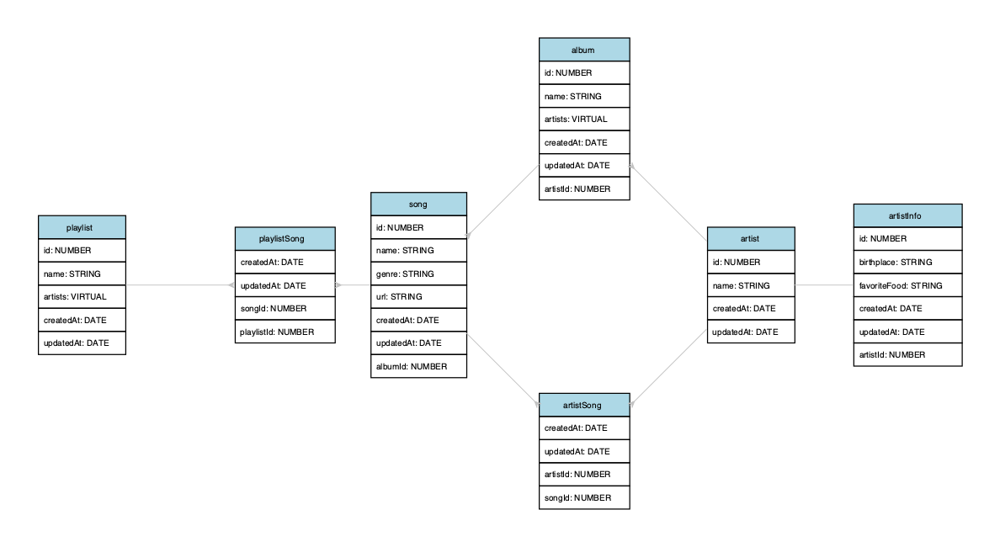

# Sequelize ERD


This package takes your sequelize models and produces ERD diagrams of them.



It should be noted that the implimentation is a bit hacky. Its built on top of [mdaines](https://github.com/mdaines)'s [vis.js](https://github.com/mdaines/viz.js/) which is described as "a hack to put Graphvis on the web." It seems like it was recently taken off NPM, so it isn't included as a dependency but instead in this package.

## Installation

You _don't_ need Graphviz or any non-javascript software to use this. Just

```bash
$ npm install sequelize-erd --save-dev
```

## API

Exported from `sequelize-erd` is a function which takes your models. It can either take the `sequelize` instance or a path to a file to require. The function returns an svg of the models.

```
const {writeFileSync} = require('fs');
const Sequelize = require('sequelize');
const sequelizeErd = require('sequelize-erd');

(async function(){
  const db = new Sequelize(/* Your Sequelize config object */);
  // Import DB models here

  const svg = await sequelizeErd({ source: db }); // sequelizeErd() returns a Promise
  writeFileSync('./erd.svg', svg);

  // Writes erd.svg to local path with SVG file from your Sequelize models
})();
```

You can also customize the output format, engine, [arrow shapes](https://graphviz.gitlab.io/_pages/doc/info/arrows.html), and [line colors](https://graphviz.gitlab.io/_pages/doc/info/colors.html) as well as include/exclude specific models.

```
const svg = await sequelizeErd({
  source: db,
  format: 'json', // See available options below
  engine: 'circo',  // See available options below
  arrowShapes: {  // Any of the below 4 options formatted ['startShape', 'endShape']. If excluded, the default is used.
    BelongsToMany: ['crow', 'crow'],  // Default: ['none', 'crow']
    BelongsTo: ['inv', 'crow'], // Default: ['crow', 'none']
    HasMany: ['crow', 'inv'], // Default: ['none', 'crow']
    HasOne: ['dot', 'dot'], // Default: ['none', 'none']
  },
  color: 'green3',
  include: ['artist', 'song', 'album', 'artistSong'],
}); // sequelizeErd() returns a Promise
writeFileSync('./erd.svg', svg);
```

## From bash

### Options

- `source` relative path from project root to js file containing sequelize object with models loaded
- `destination` Where you want your ERD SVG
- `include` Only include the following models
- `exclude` Exclude the following models
- `format` File format. Options are "svg", "dot", "xdot", "plain", "plain-ext", "ps", "ps2", "json", "json0"
- `engine` Layout engine to use, options are "circo", "dot", "fdp", "neato", "osage", "twopi". Default to "circo"

We expose a binary for you to use as a npm script. If you want an erd diagram generated in your project folder every time you commit, add this to your package json.

The source path specifies a js file that must export your Sequelize DB instance. It also needs to load all your models.

```json
{
  "scripts": {
    "erd": "sequelize-erd --source ./path/to/your/sequelize/instance --destination ./erd.svg"
  }
}
```
